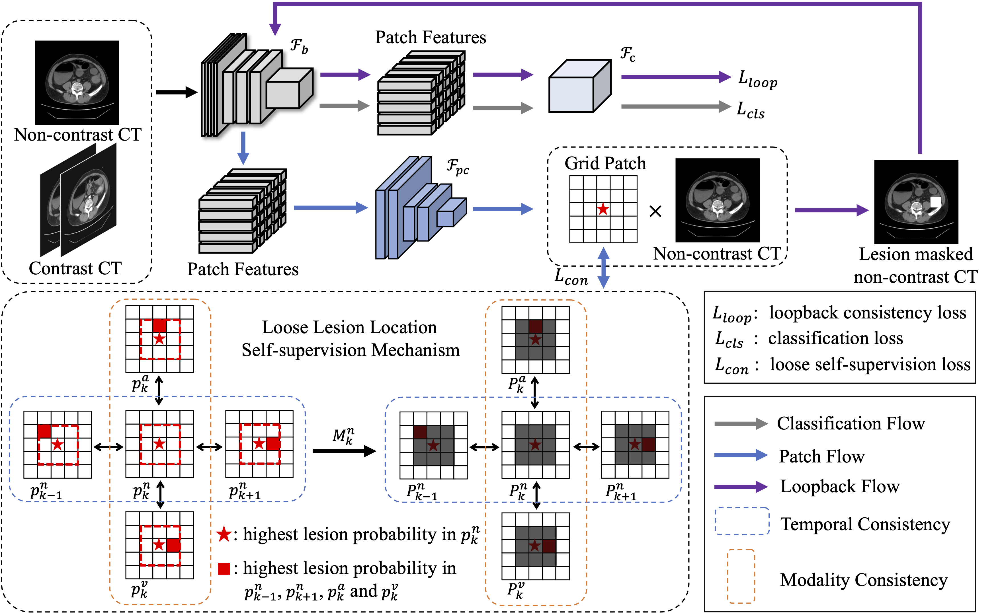

# LooseLocationSS

This repository is the official implementation of [Loose Lesion Location Self-supervision Enhanced Colorectal Cancer Diagnosis (MICCAI 2024)](https://papers.miccai.org/miccai-2024/paper/1379_paper.pdf).

## Introduction

We propose a loose lesion location self-supervision enhanced CRC diagnosis framework to reduce the requirement of fine sample annotations and improve the reliability of prediction results. For both non-contrast and contrast CT, despite potential deviations in imaging positions, the lesion location should be nearly consistent in images of both modalities at the same sequence position. In addition, lesion location in two successive slices is relatively close for the same modality. Therefore, a self-supervision mechanism is devised to enforce lesion location consistency at both temporal and modality levels of CT, reducing the need for fine annotations and enhancing the interpretability of diagnostics. Furthermore, this paper introduces a mask correction loopback strategy to reinforce the interdependence between category label and lesion location, ensuring the reliability of diagnosis.



## Usage

### Train

The model uses a two-stage training approach. Firstly, the image classification branch is trained by optimizing $L_{cls}$ to enable the model to distinguish between CRC and healthy samples. Secondly, $L_{cls}$, $L_{con}$ and $L_{loop}$ are jointly optimized to train both image classification branch and patch classification branch.

```bash
# Train image classification branch in the first stage
python train.py --mode NAP --exp_name NAP

# Jointly optimize image classification branch and patch classification branch in the second stage 
python train.py --mode N --p_cls --pretrain_weight_path run/ckpt/NAP/best.pth --exp_name Nmt
```

### Test

* classification

Slice-level and patient-level classification.

```bash
python test.py
```

* localization

Slice-level localization.

```bash
python test_loc.py --p_cls --pretrain_weight_path run/ckpt/Nmt/best.pth
```

## Citation

If you find our implementation helpful, please consider citing our paper in your work. Thanks.

```
@InProceedings{Gao_Loose_MICCAI2024,
    author = { Gao, Tianhong and Song, Jie and Yu, Xiaotian and Zhang, Shengxuming and Liang, Wenjie and Zhang, Hongbin and Li, Ziqian and Zhang, Wenzhuo and Zhang, Xiuming and Zhong, Zipeng and Song, Mingli and Feng, Zunlei},
    title = { { Loose Lesion Location Self-supervision Enhanced Colorectal Cancer Diagnosis } },
    booktitle = {proceedings of Medical Image Computing and Computer Assisted Intervention -- MICCAI 2024},
    year = {2024},
    publisher = {Springer Nature Switzerland},
    volume = {LNCS 15011},
    month = {October},
    page = {pending}
}
```
